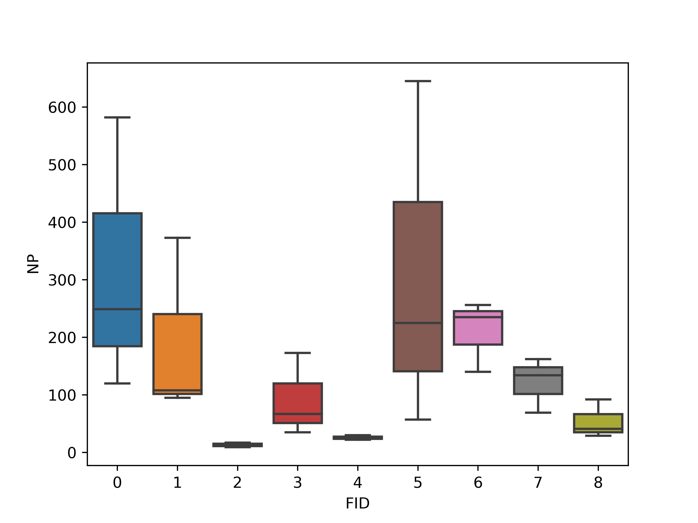

## Reclass and calculate

* 使用arcgis中的模型构建器导出，用95img和15img绘制土地利用变化图
* 将95年15年图像重分类为三类
* 栅格计算器计算地类变化
    * 如果15img- 95img =0，地类不变，赋值为95年值
    * 如果变化，使用15img+95img$\times$4计算
        * 例如 1转为2，新值 = 2 +1*4 = 6
    * 乘4是一个设计过的特殊值，使用其他值也可以达到目的，但会增加输出文件size

```python
import arcpy
# Local variables:
Path = "F:\\0001_BHLU\\Demostration\\"
year_2015_img = path+"01SourceData\\year_2015.img"
year15_rc =     path+"WS\\year15_rc"
year_1995_img = path+"01SourceData\\year_1995.img"
year95_rc =     path+"WS\\year95_rc"
year95_15 =     path+"WS\\year95-15"

# Process: 重分类 (2)
arcpy.gp.Reclassify_sa(year_2015_img, "Value", "11 2;12 2;21 1;22 1;23 1;24 1;31 1;32 1;33 1;41 1;42 1;43 1;45 1;46 1;51 3;52 3;53 3;62 1;63 1;64 1;65 1;66 1;111 2;112 2;113 2;121 2;122 2;123 2", year15_rc, "NODATA")

# Process: 重分类
arcpy.gp.Reclassify_sa(year_1995_img, "Value", "11 2;12 2;21 1;22 1;23 1;24 1;31 1;32 1;33 1;41 1;42 1;43 1;45 1;46 1;51 3;52 3;53 3;62 1;63 1;64 1;65 1;66 1;111 2;112 2;113 2;121 2;122 2;123 2", year95_rc, "NODATA")

# Process: 栅格计算器
arcpy.gp.RasterCalculator_sa("Con(\"%year15_rc%\"-\"%year95_rc%\"==0,\"%year95_rc%\",\"%year15_rc%\"+\"%year95_rc%\"*4)", year95_15)
```

## Mask and calculate 

* 使用python2.7 与 arcpy，裁剪每一个县的土地利用图
* format是python内置函数，用于字符串替换
* os.mkdirs创建文件夹
* 注意区分arcpy.SearchCursor与arcpy.da.SearchCursor

```python
# Import arcpy module
import arcpy
import time 
import os 

path = "F:\\0001_BHLU\\Demostration\\"
# Local variables:
year15_rc = path+"WS\\year15_rc"
jiangsucounty1_shp = path+"01SourceData\\jiangsucounty1.shp"
year15_mk = path+"WS\\year15_mk"

for i in range(10):
    os.makedirs(path+"Process/FID_{}".format(i))

for row in arcpy.SearchCursor(jiangsucounty1_shp):
    mask = row.getValue('shape')
    outExtractByMask = arcpy.sa.ExtractByMask(year15_rc, mask)
    outPath = path+"Process/FID_{}/year_{}.img".format(row.getValue("FID"),2015)#
    outExtractByMask.save(outPath)
    print("{}   {}".format(row.getValue("FID"),time.ctime()))
```

## Create batch for fragstats

* 使用python3，生成fragstats导入数据脚本
* 建议使用miniconda与jupyter 配置python 环境 
* 运行后将.txt替换成.fbt 用于导入

```python
import time
import os
yearlist = [1995,2005,2015]
lef = ", x, 999, x, x, 1, x, IDF_EIMG\n"

fo = open("F:/0001_BHLU/Demostration/03LanScaAna/test.txt", "w")
for i in range(10):
    input_raster = "F:/0001_BHLU/Demostration/process/FID_{}/year_2015.img".format(i)
    text = input_raster+lef
    fo.write(text)
    print(i)
fo.close()
```

## Analysis data 

* 使用 python3 读取 fragstats 输出数据并绘制箱图
    * re.findall 使用正则识别字符串中的数字
    * 第二个数字为区域FID，第三个数字为年
    * 将两个数字作为新列存入表
    * 使用seaborn boxplot 绘图，横轴区域，纵轴NP 斑块数量
    * 保存图片，dpi600

```python
import pandas as pd
import re
df= pd.read_csv("output.csv")

df["FID"]=None
df["year"]=None
for i in range(df.shape[0]):
    string = df.iloc[i,0]
    FID = re.findall(r"\d+",string)[1]
    year = re.findall(r"\d+",string)[2]
    df.iloc[i,-2]=FID
    df.iloc[i,-1]=year

import seaborn as sns
plot=sns.boxplot(x="FID",y=' NP ',data=df)

plot=plot.get_figure()
plot.savefig("output.png",dpi=600)
```



## Boxplot in R

* 使用 R读取 fragstats 输出数据并绘制箱图
* ggplot绘图

```R
setwd("F:/0001_BHLU/Demostration/03LanScaAna")
data1 = read.csv("01output.csv")

library(ggplot2)
ggplot( aes(x=FID, y=PD,group= FID,fill=as.factor(FID)),data=data1) + geom_boxplot() 
# +  scale_fill_brewer(palette="Reds")
# # BuGn Reds
```

## Gallery

* ggplot in R  https://www.r-graph-gallery.com/

* d3.js in Javascript https://d3js.org/

* matplotlib in python  https://matplotlib.org/gallery.html#showcase
* seaborn  in python https://seaborn.pydata.org/examples/index.html
* NCL http://www.ncarg.ucar.edu/examples.html
* 数据可视化目录 https://datavizcatalogue.com/ZH/
* 30天地图挑战 #30days map challenge gallery https://david.frigge.nz/30DayMapChallenge/maps.html

* my earth https://adamzh0u.github.io/Pages/