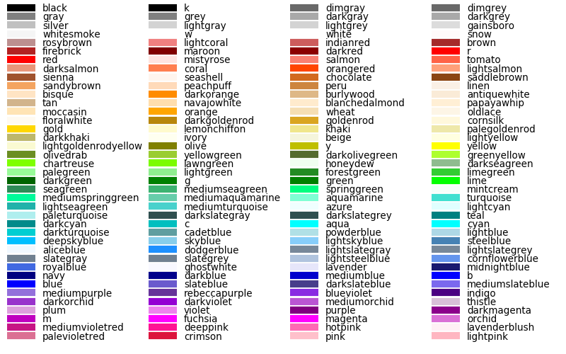

^^^^^^^^^^^^^^^^^
Scientific Plots
^^^^^^^^^^^^^^^^^

My Plots
****************

loglogplot
===================
.. code-block:: python
    :linenos:

    def loglogplot(x,y,labelx="LogPop",labely="LogArea"):
        plt.style.use('ggplot')
        xd,yd=np.log10(x),np.log10(y)
        # make the scatter plot
        fig, ax = plt.subplots(figsize=(5,4))

        ax.set_yscale("log")
        ax.set_xscale("log")
        #ax.set_ylim(1e1,10**3.4)
        #ax.set_xlim(10**(-0.1),10**(2.5))
        # determine best fit line
        par = np.polyfit(xd, yd, 1,full=True)

        slope=par[0][0]
        intercept=par[0][1]

        xl = [min(xd), max(xd)]
        yl = [slope*xx + intercept  for xx in xl]
        ax.plot([10**xx for xx in xl],[10**yy for yy in yl], '-m')

        # coefficient of determination, plot text
        variance = np.var(yd)#方差
        residuals = np.var([(slope*xx + intercept - yy)  for xx,yy in zip(xd,yd)])#残差

        Rsqr = np.round(1-residuals/variance, decimals=2)
        #ax.text(0.3*max(x),1.2*max(y),r'$R^2 ={0.2f} \n Slope={0.2f}'.format{Rsqr,slope.round(2)}, fontsize=15)
        ax.text(min(x),1.1*max(y),'%s =%0.2f\nSlope=%0.2f\nIntercept=%0.2f'%("$\sf{R^2}$",Rsqr,slope.round(2),intercept), fontsize=8)
        print(variance,residuals)
        plt.xlabel(labelx)
        plt.ylabel(labely)

        # error bounds
        yerr = [abs(slope*xx + intercept - yy)  for xx,yy in zip(xd,yd)]
        par = np.polyfit(xd, yerr, 2, full=True)
        erro_x2 = par[0][0]
        erro_x1 = par[0][1]
        erro_x0 = par[0][2]
        yerrUpper = [(xx*slope+intercept)+(erro_x2*xx**2 + erro_x1*xx + erro_x0) for xx,yy in zip(xd,yd)]
        yerrLower = [(xx*slope+intercept)-(erro_x2*xx**2 + erro_x1*xx + erro_x0) for xx,yy in zip(xd,yd)]
        print(erro_x2, erro_x1, erro_x0)

        #     ax.plot([10**xx for xx in xd],[10**yy for yy in yerrLower], 'm')
        #     ax.plot([10**xx for xx in xd],[10**yy for yy in yerrUpper], 'm')
        ax.scatter(x, y, s=10, alpha=1, marker='h',color="orangered")

        yline = [slope*xl[0] + intercept,xl[1] + intercept]
        #yline2 = [xl[0] + intercept,slope*xl[1] + intercept]
        ax.plot([10**xx for xx in xl],[10**yy for yy in yline], '--m')
        #ax.plot([10**xx for xx in xl],[10**yy for yy in yline2], '--m')
        ax.text(250,660, "Slope=1", size = 5,\
                family = "fantasy", color = "r", style = "italic", weight = "light",\
                )#bbox = dict(facecolor = "r", alpha = 0.2)
        return slope,ax

.. image:: ./00_img/loglogplot.png

Scientific style plot
============================
.. code-block:: python
    :linenos:

    import numpy as np
    import matplotlib.pyplot as plt
    import pandas as pd
    import matplotlib.ticker as mtick
    from mpltools import annotation

    plt.style.use("science")
    fig = plt.figure(figsize=(3.5, 2.625),dpi=600)
    ax = fig.add_subplot(1,1,1)

    ax.set_xlim((-0.6,0.6))
    ax.set_ylim((-0.1,0.1))
    ax.plot([-0.6,0.6],[0,0], linewidth=0.8, color='black' )
    ax.plot([0,0],[-0.1,0.1], linewidth=0.8, color='black' )
    #ax.scatter(x_CA,y_FI,s=1,marker='o')
    ax.plot(x_FI,y_CA, linewidth=0,ms=2,
            marker='o', markerfacecolor='w',markeredgecolor='k',markeredgewidth=0.5,zorder=30)

    ax.set_xlabel("FI")
    ax.set_ylabel("CA")

    plt.annotate('9', xy=(-0.20, 0.03), xytext=(-0.30, 0.05),
                    arrowprops=dict(facecolor='black',arrowstyle="->"))
    plt.annotate('10', xy=(0.23, -0.08), xytext=(0.051, -0.09),
                    arrowprops=dict(facecolor='black',arrowstyle="->"))
    plt.annotate('18', xy=(0.548, -0.029), xytext=(0.41,-0.015),
                    arrowprops=dict(facecolor='black',arrowstyle="->"))
    # plt.annotate('23', xy=(0.099, 0.006), xytext=(0.2,0.02),
    #              arrowprops=dict(facecolor='black',arrowstyle="->"))
    plt.annotate('5', xy=(0.27, -0.06), xytext=(0.39,-0.07),
                    arrowprops=dict(facecolor='black',arrowstyle="->"))

    ax.grid(linestyle="--", linewidth=0.2, color='.25', zorder=50,alpha=0.5)
    vals = ax.get_yticks()
    ax.set_yticklabels(['{:3.0f}\%'.format(x*100) for x in vals])
    vals = ax.get_xticks()
    ax.set_xticklabels(['{:3.0f}\%'.format(x*100) for x in vals])

    par = np.polyfit(x_FI, y_CA, 1,full=True)
    slope=par[0][0]
    intercept=par[0][1]
    xl = [-0.5, max(x_FI)]
    yl = [slope*xx + intercept  for xx in xl]
    ax.plot([xx for xx in xl],[yy for yy in yl], '--k',zorder=20)

    variance = np.var(y_CA)#方差
    residuals = np.var([(slope*xx + intercept - yy)  for xx,yy in zip(x_FI,y_CA)])#残差
    Rsqr = np.round(1-residuals/variance, decimals=2)
    ax.text(0.35,0.08,'%s=%0.2f\nSlope=%0.2f'%("${R^2}$",Rsqr,slope.round(2)), fontsize=6)

    # annotation.slope_marker((-0.4, 0.03), -0.11,
    #                         text_kwargs={'color': 'k'},
    #                         poly_kwargs={'facecolor': "k"})

    # \sf
    plt.show()
    fig.savefig("Four-quadrant.png",dpi=600)

.. image:: ./00_img/CA_FI-rat0_2.0.png

HDI-LDI
==============
.. code-block:: python
    :linenos:

    import matplotlib.pyplot as plt
    import numpy as np
    import scipy.stats as stats
    import pandas as pd
    from matplotlib.font_manager import FontProperties
    from matplotlib.ticker import AutoMinorLocator, MultipleLocator, FuncFormatter

    fig, ax1 = plt.subplots(figsize = (3.5,2.625),dpi=200)
    #https://matplotlib.org/3.1.1/api/_as_gen/matplotlib.axes.Axes.tick_params.html#matplotlib.axes.Axes.tick_params
    B,=ax1.plot(i, x,"^k",ls="",lw=1,ms=2,label="HDI")

    #ax1.minorticks_on()
    ax1.tick_params("x",which = "major",direction = "in" ,
                    length=3,width = 0.5,labelrotation=90,labelsize=6)
    ax1.xaxis.set_major_locator(ticker.MultipleLocator(1))
    # ax1.tick_params("x",which = "minor",direction = "in",
    #                 length=3,width = 0.5, bottom = True, top=True,
    #                 labelbottom=True)
    xticks = [i for i in range(1,37)]
    ax1.set_xlim(0,37)
    ax1.set_ylim(0.3,1.3)
    ax1.set_xticklabels(a,size=6)

    # ax1 y
    ax1.yaxis.set_minor_locator(AutoMinorLocator(4))
    ax1.tick_params("y",which = "major",direction = "in",
                length=3,width = 0.5,right=True ,labelsize=6)
    # def minor_tick(x, pos):
    #     if not x % 1.0:
    #         return ""
    #     return "%.2f" % x

    # ax1.yaxis.set_minor_formatter(FuncFormatter(minor_tick))
    ax1.tick_params("y",which = "minor",direction = "in",
                length=1.5,width = 0.5,right=True ,labelsize=6)
    labels = ax1.get_xticklabels() + ax1.get_yticklabels()
    [label.set_fontname('Times New Roman') for label in labels]

    ## ax2
    ax2 = ax1.twinx()
    A,=ax2.plot(i,y,"d--k",lw=1,ms=2,label="LDI")
    ax2.set_ylim(0.3,1.3)
    ax2.yaxis.set_minor_locator(AutoMinorLocator(4))
    ax2.tick_params("y",which = "major",direction = "in",
                length=3,width = 0.5,right=True ,labelsize=6)
    labels = ax2.get_yticklabels()
    [label.set_fontname('Times New Roman') for label in labels]
    # def minor_tick(x, pos):
    #     if not x % 1.0:
    #         return ""
    #     return "%.2f" % x

    # ax1.yaxis.set_minor_formatter(FuncFormatter(minor_tick))
    ax2.tick_params("y",which = "minor",direction = "in",
                length=1.5,width = 0.5,right=True ,labelsize=5)

    ax1.grid(which="major",axis="y",lw=0.4)

    font1 = {'family' : 'Times New Roman',
    'weight' : 'normal',
    'size'   : 6}

    ax1.set_ylabel("HDI",font1,size=8)
    ax2.set_ylabel("LDI",font1,size=8)
    ax1.set_xlabel("Hotspots",font1,size=8)

    ax1.legend(handles=[A,B],prop=font1,frameon=False,loc="lower left")
    fig.savefig("HDI-LDI-plot_8_31.png",dpi=1000)

.. image:: ./00_img/HDI-LDI-plot_8_31.png

Proportion and change rate
=====================================
.. code-block:: python
    :linenos:
        
    import pandas as pd
    import numpy as np
    import matplotlib.pyplot as plt
    from matplotlib import gridspec
    from matplotlib.ticker import AutoMinorLocator, MultipleLocator, FuncFormatter,MaxNLocator

    df1_gp=pd.DataFrame()
    df2=pd.DataFrame()
    su={}
    for i in range(36):
        df1 = pd.read_excel("path_to_file.xlsx",sheet_name="ID_{}".format(i)).set_index("ID")
        S1 = df1.loc[6,:].rename(i)# nature
        df2 = df2.append(S1)
        S = (df1.loc[6,:]/df1.loc[6,1992]-1).rename(i)
        df1_gp=df1_gp.append(S)
        S2=sum(df1.loc[[5,6,7],1992])
        su[i] =S2

    df2_num=df2
    for i in range(36):
        df2_num.loc[i,1992]=df2_num.loc[i,1992]/su[i]

    df2_num=df2_num.sort_values(by=1992)
    index = list(df2_num.index)
    # df1_reindex=df1_gp.reindex(index)
    # df1_reindex.describe()

    def ax_y_settings(ax, var_name, x_min, x_max):
        ax.set_xlim(x_min,x_max)
        #ax.set_ylim(y_min,y_max)
        ax.set_yticks([])
        #ax.spines['left'].set_visible(False)
        ax.spines['right'].set_visible(False)
        ax.spines['top'].set_visible(False)
        #ax.spines['bottom'].set_visible(False)
        #ax.spines['bottom'].set_edgecolor(='#444444')
        ax.spines['bottom'].set_linewidth(0)
        ax.spines['left'].set_linewidth(0.3)
        ax.text(0.01, 0.3, var_name, font1, transform = ax.transAxes)
        return None

    fig = plt.figure(figsize=(3.267,4.5),dpi=1000)

    number_gp=36
    gs0 = gridspec.GridSpec(nrows=1,
                        ncols=2,
                        figure=fig,
                        width_ratios= [1,3],
                        wspace=0, hspace=0
                        )
    gs0.tight_layout(fig,pad=0)
    #height_ratios= [1]*number_gp

    ax = [None]*(number_gp + 1)## important

    font1 = {'family' : 'Times New Roman','weight' : 'normal','size'   : 6}
    cmap1 = plt.get_cmap("summer")

    gs01=gs0[1].subgridspec(number_gp,1)
    #https://matplotlib.org/3.1.1/gallery/subplots_axes_and_figures/gridspec_nested.html#sphx-glr-gallery-subplots-axes-and-figures-gridspec-nested-py

    ##ax0
    ax[0] = fig.add_subplot(gs0[0])
    ax[0].spines['right'].set_visible(False)
    ax[0].spines['left'].set_visible(False)
    ax[0].spines['top'].set_visible(False)
    ax[0].spines['bottom'].set_linewidth(0.3)

    perc= df2_num.iloc[:,0]
    features = [i+1 for i in range(number_gp)]

    ax[0].barh(features, -1*perc, color=cmap1(0.1), height=0.4)

    ax[0].invert_yaxis()
    ax[0].set_yticks([])
    ax[0].set_ylim([36.5,0.5])

    ax[0].xaxis.set_major_locator(MultipleLocator(0.5))
    b = ["","100%","50%","-----"]
    ax[0].set_xticklabels(b,font1)
    ax[0].tick_params("x",which = "major",direction = "in",
                            length=1.5,width = 0.5 ,labelsize=6,rotation=90)
    ax[0].set_title("Proportion",font1)

    ## ax36
    for i in range(number_gp):
        ax[i+1] = fig.add_subplot(gs01[i,0])
        ax_y_settings(ax[i+1],index[i]+1,-0.6,0.16)

        rc = ax[i+1].scatter(df1_reindex.iloc[i,:],[0]*24,
                    c=[i for i in range(24)],cmap=cmap1,
                    marker = "o",s=4,
                    lw=0.1,edgecolors="k",
                    zorder=20)
        #ax[i].stackplot(df1_gp.columns,df1_gp.loc[i,:])
        #sns.kdeplot(data=df1_gp.loc[i,:],ax=ax[i], shade=True, color="blue",  bw=300, legend=False)
        #ax[i].plot([-0.08,0.05],[0,0],"--k",lw=0.1)
        ax[i+1].axhline(0,0.125,1,ls="--",c="k",lw=0.2,zorder=10)
        ax[i+1].plot([0,0],[-1,1],"-k",lw=0.2,zorder=10)
        if i < (number_gp - 1):#1-35
            ax[i+1].set_xticks([])
            if i == 0:
                ax[i+1].set_title("Change rate compared to 1992 ",font1)
        else:#36
            ax[i+1].spines['bottom'].set_linewidth(0.3)
            ax[i+1].spines['bottom'].set_edgecolor('k')

            a1 = [-0.08,-0.06,-0.04,-0.02,0,0.02,0.04]
            a = ["",""]+['{:3.0f}%'.format(x*100) for x in a1]
            ax[i+1].set_xticklabels(a,font1,size=6,)
            ax[i+1].xaxis.set_major_locator(MultipleLocator(0.02))
            ax[i+1].tick_params("x",which = "major",direction = "in",
                            length=1.5,width = 0.5 ,labelsize=6,rotation=90)
        #ax[i].plot([1992,2015],[0,0],"--k")

    # colorbar

    cbar = fig.colorbar(rc,ax=[ax[i] for i in range(1,37)],shrink=0.3,
                    drawedges=False)
    cbar.ax.get_yaxis().set_major_locator(MultipleLocator(23))
    #cbar.ax.get_yaxis().set_ticklabels(["","1992","2015",""])
    cbar.ax.set_yticklabels(["","1992","2015",""],font1,rotation=270)
    cbar.ax.set_ylabel('Year', font1,rotation=270)
    cbar.ax.tick_params("y",which = "major",direction = "in",
                            length=0,width = 0.5 ,labelsize=6,rotation=270)

    fig.savefig("demo1.png",bbox_inches="tight",dpi=1200,pad_inches=0)

.. image:: ./00_img/Nature_change-9.2.png

legend 
=====================
.. code-block:: python
    :linenos:

    import matplotlib.pyplot as plt
    from matplotlib.lines import Line2D
    fig, ax5 = plt.subplots()

    x = [1,2,3]
    y = [2,3,5]
    pop = [2,4,5]

    scatter=ax5.scatter(x=x, y=y, s=pop,c="white",edgecolor="black")
    handles, labels = scatter.legend_elements(prop="sizes",c="black")
    legend_elements = [Line2D([0], [0], marker='o', color='w', label='Scatter',
                            mec = "b",mfc='w', markersize=15),
                        Line2D([0], [0], marker='o', color='w', label='Scatter',
                        mec = "b",mfc='w', markersize=14),
                        Line2D([0], [0], marker='o', color='w', label='Scatter',
                        mec = "b",mfc='w', markersize=23)]

    ax5.set_xlabel("Rank of Per capita built-up area",fontdict={'family':'Times New Roman','size':16})
    ax5.set_ylabel("Rank of LIP",fontdict={'family':'Times New Roman','size':16})
    ax5.legend(handles = legend_elements,
        frameon=False,
        loc='lower right',title="demo",ncol=2,fontsize=12,title_fontsize=12)
    ax5.text(-0.12,0.95,"(e)",transform=ax5.transAxes,fontdict={'family':'Times New Roman','size':16})
    plt.show()

Configures
***********************

Scientific style
========================
.. code-block:: python
    :linenos:

    # I:\Home\.matplotlib\stylelib\science.mplstyle
    # Matplotlib style for general scientific plots

    # Set color cycle
    axes.prop_cycle : cycler('color', ['0C5DA5', '00B945', 'FF9500', 'FF2C00', '845B97', '474747', '9e9e9e'])

    # Set default figure size
    figure.figsize : 3.5, 2.625

    # Set x axis
    xtick.direction : in
    xtick.major.size : 3
    xtick.major.width : 0.5
    xtick.minor.size : 1.5
    xtick.minor.width : 0.5
    xtick.minor.visible :   True
    xtick.top : True

    # Set y axis
    ytick.direction : in
    ytick.major.size : 3
    ytick.major.width : 0.5
    ytick.minor.size : 1.5
    ytick.minor.width : 0.5
    ytick.minor.visible :   True
    ytick.right : True

    # Set line widths
    axes.linewidth : 0.5
    grid.linewidth : 0.5
    lines.linewidth : 1.

    # Remove legend frame
    legend.frameon : False

    # Always save as 'tight'
    savefig.bbox : tight
    savefig.pad_inches : 0.05

    # Use serif fonts
    font.serif : Times New Roman
    font.family : serif

    # Use LaTeX for math formatting
    text.usetex : True
    text.latex.preamble : \usepackage{amsmath} \usepackage[T1]{fontenc}

IEEE style
==================
.. code-block:: python
    :linenos:

    # Matplotlib style for IEEE plots
    # This style should work for most two-column journals

    # Set color cycle
    # Set line style as well for black and white graphs
    axes.prop_cycle : (cycler('color', ['k', 'r', 'b', 'g']) + cycler('ls', ['-', '--', ':', '-.']))

    # Set default figure size
    figure.figsize : 3.3, 2.5
    figure.dpi : 600

    # Font sizes
    font.size : 8

Named Colors
=====================

"""
========================
Visualizing named colors
========================
.. code-block:: python
    :linenos:

    """
    ========================
    Visualizing named colors
    ========================
    Simple plot example with the named colors and its visual representation.
    """
    from __future__ import division

    import matplotlib.pyplot as plt
    from matplotlib import colors as mcolors

    colors = dict(mcolors.BASE_COLORS, **mcolors.CSS4_COLORS)

    # Sort colors by hue, saturation, value and name.
    by_hsv = sorted((tuple(mcolors.rgb_to_hsv(mcolors.to_rgba(color)[:3])), name)
                    for name, color in colors.items())
    sorted_names = [name for hsv, name in by_hsv]

    n = len(sorted_names)
    ncols = 4
    nrows = n // ncols + 1

    fig, ax = plt.subplots(figsize=(8, 5))

    # Get height and width
    X, Y = fig.get_dpi() * fig.get_size_inches()
    h = Y / (nrows + 1)
    w = X / ncols

    for i, name in enumerate(sorted_names):
        col = i % ncols
        row = i // ncols
        y = Y - (row * h) - h

        xi_line = w * (col + 0.05)
        xf_line = w * (col + 0.25)
        xi_text = w * (col + 0.3)

        ax.text(xi_text, y, name, fontsize=(h * 0.8),
                horizontalalignment='left',
                verticalalignment='center')

        ax.hlines(y + h * 0.1, xi_line, xf_line,
                color=colors[name], linewidth=(h * 0.6))

    ax.set_xlim(0, X)
    ax.set_ylim(0, Y)
    ax.set_axis_off()

    fig.subplots_adjust(left=0, right=1,
                        top=1, bottom=0,
                        hspace=0, wspace=0)
    plt.show()

