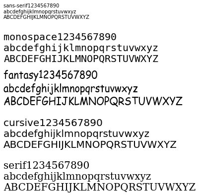
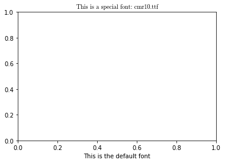
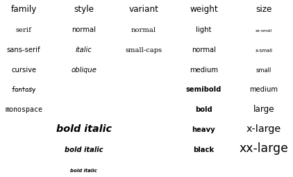
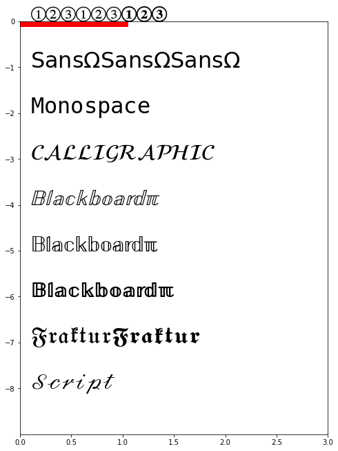
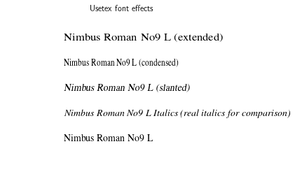

```python
import matplotlib as mpl
import matplotlib.pyplot as plt
```

## Modules

* https://matplotlib.org/3.2.1/api/index.html#modules
* [matplotlib](#matplotlib)
* [matplotlib.font_manager](#font_manager)

### matplotlib


```python
# https://matplotlib.org/api/matplotlib_configuration_api.html

## backend
mpl.use("TkAgg")
mpl.interactive(False)

## Default values and styling
mpl.rcParams  # 显示rc配置
mpl.matplotlib_fname()   # 显示rc文件位置
mpl.rc(group, **kwargs)
mpl.rcdefaults()  # 默认rc
mpl.rc_file(fname, *, use_default_template=True) # "~\.matplotlib\matplotlibrc"
mpl.rc_context(rc=None, fname=None) # with mpl.rc_context(rc={'text.usetex': True}, fname='screen.rc'):plt.plot(x, a)

###  set rc 
mpl.rc('lines', linewidth=2, color='r') ## 
font = {'family' : 'monospace','weight' : 'bold','size' : 12}
mpl.rc('font', **font)  # pass in the font dict as kwargs

## logging
mpl.set_loglevel("info")# {"notset", "debug", "info", "warning", "error", "critical"}
```


```python
mpl.rcdefaults()
mpl.rcParams## defalut
```


    RcParams({'_internal.classic_mode': False,
              'agg.path.chunksize': 0,
              'animation.avconv_args': [],
              'animation.avconv_path': 'avconv',
              'animation.bitrate': -1,
              'animation.codec': 'h264',
              'animation.convert_args': [],
              'animation.convert_path': 'convert',
              'animation.embed_limit': 20.0,
              'animation.ffmpeg_args': [],
              'animation.ffmpeg_path': 'ffmpeg',
              'animation.frame_format': 'png',
              'animation.html': 'none',
              'animation.html_args': [],
              'animation.writer': 'ffmpeg',
              'axes.autolimit_mode': 'data',
              'axes.axisbelow': 'line',
              'axes.edgecolor': 'black',
              'axes.facecolor': 'white',
              'axes.formatter.limits': [-5, 6],
              'axes.formatter.min_exponent': 0,
              'axes.formatter.offset_threshold': 4,
              'axes.formatter.use_locale': False,
              'axes.formatter.use_mathtext': False,
              'axes.formatter.useoffset': True,
              'axes.grid': False,
              'axes.grid.axis': 'both',
              'axes.grid.which': 'major',
              'axes.labelcolor': 'black',
              'axes.labelpad': 4.0,
              'axes.labelsize': 'medium',
              'axes.labelweight': 'normal',
              'axes.linewidth': 0.8,
              'axes.prop_cycle': cycler('color', ['#1f77b4', '#ff7f0e', '#2ca02c', '#d62728', '#9467bd', '#8c564b', '#e377c2', '#7f7f7f', '#bcbd22', '#17becf']),
              'axes.spines.bottom': True,
              'axes.spines.left': True,
              'axes.spines.right': True,
              'axes.spines.top': True,
              'axes.titlecolor': 'auto',
              'axes.titlelocation': 'center',
              'axes.titlepad': 6.0,
              'axes.titlesize': 'large',
              'axes.titleweight': 'normal',
              'axes.unicode_minus': True,
              'axes.xmargin': 0.05,
              'axes.ymargin': 0.05,
              'axes3d.grid': True,
              'backend': 'TkAgg',
              'backend_fallback': True,
              'boxplot.bootstrap': None,
              'boxplot.boxprops.color': 'black',
              'boxplot.boxprops.linestyle': '-',
              'boxplot.boxprops.linewidth': 1.0,
              'boxplot.capprops.color': 'black',
              'boxplot.capprops.linestyle': '-',
              'boxplot.capprops.linewidth': 1.0,
              'boxplot.flierprops.color': 'black',
              'boxplot.flierprops.linestyle': 'none',
              'boxplot.flierprops.linewidth': 1.0,
              'boxplot.flierprops.marker': 'o',
              'boxplot.flierprops.markeredgecolor': 'black',
              'boxplot.flierprops.markeredgewidth': 1.0,
              'boxplot.flierprops.markerfacecolor': 'none',
              'boxplot.flierprops.markersize': 6.0,
              'boxplot.meanline': False,
              'boxplot.meanprops.color': 'C2',
              'boxplot.meanprops.linestyle': '--',
              'boxplot.meanprops.linewidth': 1.0,
              'boxplot.meanprops.marker': '^',
              'boxplot.meanprops.markeredgecolor': 'C2',
              'boxplot.meanprops.markerfacecolor': 'C2',
              'boxplot.meanprops.markersize': 6.0,
              'boxplot.medianprops.color': 'C1',
              'boxplot.medianprops.linestyle': '-',
              'boxplot.medianprops.linewidth': 1.0,
              'boxplot.notch': False,
              'boxplot.patchartist': False,
              'boxplot.showbox': True,
              'boxplot.showcaps': True,
              'boxplot.showfliers': True,
              'boxplot.showmeans': False,
              'boxplot.vertical': True,
              'boxplot.whiskerprops.color': 'black',
              'boxplot.whiskerprops.linestyle': '-',
              'boxplot.whiskerprops.linewidth': 1.0,
              'boxplot.whiskers': 1.5,
              'contour.corner_mask': True,
              'contour.negative_linestyle': 'dashed',
              'datapath': 'd:\\anaconda\\envs\\py37\\lib\\site-packages\\matplotlib\\mpl-data',
              'date.autoformatter.day': '%Y-%m-%d',
              'date.autoformatter.hour': '%m-%d %H',
              'date.autoformatter.microsecond': '%M:%S.%f',
              'date.autoformatter.minute': '%d %H:%M',
              'date.autoformatter.month': '%Y-%m',
              'date.autoformatter.second': '%H:%M:%S',
              'date.autoformatter.year': '%Y',
              'docstring.hardcopy': False,
              'errorbar.capsize': 0.0,
              'figure.autolayout': False,
              'figure.constrained_layout.h_pad': 0.04167,
              'figure.constrained_layout.hspace': 0.02,
              'figure.constrained_layout.use': False,
              'figure.constrained_layout.w_pad': 0.04167,
              'figure.constrained_layout.wspace': 0.02,
              'figure.dpi': 100.0,
              'figure.edgecolor': 'white',
              'figure.facecolor': 'white',
              'figure.figsize': [6.4, 4.8],
              'figure.frameon': True,
              'figure.max_open_warning': 20,
              'figure.subplot.bottom': 0.11,
              'figure.subplot.hspace': 0.2,
              'figure.subplot.left': 0.125,
              'figure.subplot.right': 0.9,
              'figure.subplot.top': 0.88,
              'figure.subplot.wspace': 0.2,
              'figure.titlesize': 'large',
              'figure.titleweight': 'normal',
              'font.cursive': ['Apple Chancery',
                               'Textile',
                               'Zapf Chancery',
                               'Sand',
                               'Script MT',
                               'Felipa',
                               'cursive'],
              'font.family': ['sans-serif'],
              'font.fantasy': ['Comic Neue',
                               'Comic Sans MS',
                               'Chicago',
                               'Charcoal',
                               'Impact',
                               'Western',
                               'Humor Sans',
                               'xkcd',
                               'fantasy'],
              'font.monospace': ['DejaVu Sans Mono',
                                 'Bitstream Vera Sans Mono',
                                 'Computer Modern Typewriter',
                                 'Andale Mono',
                                 'Nimbus Mono L',
                                 'Courier New',
                                 'Courier',
                                 'Fixed',
                                 'Terminal',
                                 'monospace'],
              'font.sans-serif': ['DejaVu Sans',
                                  'Bitstream Vera Sans',
                                  'Computer Modern Sans Serif',
                                  'Lucida Grande',
                                  'Verdana',
                                  'Geneva',
                                  'Lucid',
                                  'Arial',
                                  'Helvetica',
                                  'Avant Garde',
                                  'sans-serif'],
              'font.serif': ['DejaVu Serif',
                             'Bitstream Vera Serif',
                             'Computer Modern Roman',
                             'New Century Schoolbook',
                             'Century Schoolbook L',
                             'Utopia',
                             'ITC Bookman',
                             'Bookman',
                             'Nimbus Roman No9 L',
                             'Times New Roman',
                             'Times',
                             'Palatino',
                             'Charter',
                             'serif'],
              'font.size': 10.0,
              'font.stretch': 'normal',
              'font.style': 'normal',
              'font.variant': 'normal',
              'font.weight': 'normal',
              'grid.alpha': 1.0,
              'grid.color': '#b0b0b0',
              'grid.linestyle': '-',
              'grid.linewidth': 0.8,
              'hatch.color': 'black',
              'hatch.linewidth': 1.0,
              'hist.bins': 10,
              'image.aspect': 'equal',
              'image.cmap': 'viridis',
              'image.composite_image': True,
              'image.interpolation': 'antialiased',
              'image.lut': 256,
              'image.origin': 'upper',
              'image.resample': True,
              'interactive': True,
              'keymap.all_axes': ['a'],
              'keymap.back': ['left', 'c', 'backspace', 'MouseButton.BACK'],
              'keymap.copy': ['ctrl+c', 'cmd+c'],
              'keymap.forward': ['right', 'v', 'MouseButton.FORWARD'],
              'keymap.fullscreen': ['f', 'ctrl+f'],
              'keymap.grid': ['g'],
              'keymap.grid_minor': ['G'],
              'keymap.help': ['f1'],
              'keymap.home': ['h', 'r', 'home'],
              'keymap.pan': ['p'],
              'keymap.quit': ['ctrl+w', 'cmd+w', 'q'],
              'keymap.quit_all': ['W', 'cmd+W', 'Q'],
              'keymap.save': ['s', 'ctrl+s'],
              'keymap.xscale': ['k', 'L'],
              'keymap.yscale': ['l'],
              'keymap.zoom': ['o'],
              'legend.borderaxespad': 0.5,
              'legend.borderpad': 0.4,
              'legend.columnspacing': 2.0,
              'legend.edgecolor': '0.8',
              'legend.facecolor': 'inherit',
              'legend.fancybox': True,
              'legend.fontsize': 'medium',
              'legend.framealpha': 0.8,
              'legend.frameon': True,
              'legend.handleheight': 0.7,
              'legend.handlelength': 2.0,
              'legend.handletextpad': 0.8,
              'legend.labelspacing': 0.5,
              'legend.loc': 'best',
              'legend.markerscale': 1.0,
              'legend.numpoints': 1,
              'legend.scatterpoints': 1,
              'legend.shadow': False,
              'legend.title_fontsize': None,
              'lines.antialiased': True,
              'lines.color': 'C0',
              'lines.dash_capstyle': 'butt',
              'lines.dash_joinstyle': 'round',
              'lines.dashdot_pattern': [6.4, 1.6, 1.0, 1.6],
              'lines.dashed_pattern': [3.7, 1.6],
              'lines.dotted_pattern': [1.0, 1.65],
              'lines.linestyle': '-',
              'lines.linewidth': 1.5,
              'lines.marker': 'None',
              'lines.markeredgecolor': 'auto',
              'lines.markeredgewidth': 1.0,
              'lines.markerfacecolor': 'auto',
              'lines.markersize': 6.0,
              'lines.scale_dashes': True,
              'lines.solid_capstyle': 'projecting',
              'lines.solid_joinstyle': 'round',
              'markers.fillstyle': 'full',
              'mathtext.bf': 'sans:bold',
              'mathtext.cal': 'cursive',
              'mathtext.default': 'it',
              'mathtext.fallback_to_cm': True,
              'mathtext.fontset': 'dejavusans',
              'mathtext.it': 'sans:italic',
              'mathtext.rm': 'sans',
              'mathtext.sf': 'sans',
              'mathtext.tt': 'monospace',
              'mpl_toolkits.legacy_colorbar': True,
              'patch.antialiased': True,
              'patch.edgecolor': 'black',
              'patch.facecolor': 'C0',
              'patch.force_edgecolor': False,
              'patch.linewidth': 1.0,
              'path.effects': [],
              'path.simplify': True,
              'path.simplify_threshold': 0.1111111111111111,
              'path.sketch': None,
              'path.snap': True,
              'pdf.compression': 6,
              'pdf.fonttype': 3,
              'pdf.inheritcolor': False,
              'pdf.use14corefonts': False,
              'pgf.preamble': '',
              'pgf.rcfonts': True,
              'pgf.texsystem': 'xelatex',
              'polaraxes.grid': True,
              'ps.distiller.res': 6000,
              'ps.fonttype': 3,
              'ps.papersize': 'letter',
              'ps.useafm': False,
              'ps.usedistiller': None,
              'savefig.bbox': None,
              'savefig.directory': '~',
              'savefig.dpi': 'figure',
              'savefig.edgecolor': 'white',
              'savefig.facecolor': 'white',
              'savefig.format': 'png',
              'savefig.frameon': True,
              'savefig.jpeg_quality': 95,
              'savefig.orientation': 'portrait',
              'savefig.pad_inches': 0.1,
              'savefig.transparent': False,
              'scatter.edgecolors': 'face',
              'scatter.marker': 'o',
              'svg.fonttype': 'path',
              'svg.hashsalt': None,
              'svg.image_inline': True,
              'text.antialiased': True,
              'text.color': 'black',
              'text.hinting': 'auto',
              'text.hinting_factor': 8,
              'text.kerning_factor': 0,
              'text.latex.preamble': '',
              'text.latex.preview': False,
              'text.latex.unicode': True,
              'text.usetex': False,
              'timezone': 'UTC',
              'tk.window_focus': False,
              'toolbar': 'toolbar2',
              'verbose.fileo': 'sys.stdout',
              'verbose.level': 'silent',
              'webagg.address': '127.0.0.1',
              'webagg.open_in_browser': True,
              'webagg.port': 8988,
              'webagg.port_retries': 50,
              'xtick.alignment': 'center',
              'xtick.bottom': True,
              'xtick.color': 'black',
              'xtick.direction': 'out',
              'xtick.labelbottom': True,
              'xtick.labelsize': 'medium',
              'xtick.labeltop': False,
              'xtick.major.bottom': True,
              'xtick.major.pad': 3.5,
              'xtick.major.size': 3.5,
              'xtick.major.top': True,
              'xtick.major.width': 0.8,
              'xtick.minor.bottom': True,
              'xtick.minor.pad': 3.4,
              'xtick.minor.size': 2.0,
              'xtick.minor.top': True,
              'xtick.minor.visible': False,
              'xtick.minor.width': 0.6,
              'xtick.top': False,
              'ytick.alignment': 'center_baseline',
              'ytick.color': 'black',
              'ytick.direction': 'out',
              'ytick.labelleft': True,
              'ytick.labelright': False,
              'ytick.labelsize': 'medium',
              'ytick.left': True,
              'ytick.major.left': True,
              'ytick.major.pad': 3.5,
              'ytick.major.right': True,
              'ytick.major.size': 3.5,
              'ytick.major.width': 0.8,
              'ytick.minor.left': True,
              'ytick.minor.pad': 3.4,
              'ytick.minor.right': True,
              'ytick.minor.size': 2.0,
              'ytick.minor.visible': False,
              'ytick.minor.width': 0.6,
              'ytick.right': False})


### font_manager

* 字体并不等于text
* 颜色，bbox是text对象的属性
* 默认是用family下的排序，因此先要修改排序，再查找，再使用
* 关于网络字体的渲染 ：https://medium.com/gsoc-2k19-with-mozilla/text-web-fonts-math-text-36ba884fb476


```python
## 修改font
test_font = "1234567890 \nabcdefghijklmnopqrstuvwxyz \nABCDEFGHIJKLMNOPQRSTUVWXYZ"
fig,ax = plt.subplots()
ax.set_axis_off()


## default font settings
font1 = {'family':'sans-serif',
         "name":'DejaVu Sans',
        "style":"normal", # normal (or roman), italic  or oblique
        "variant":"normal", # normal or small-caps(smaller for truetype font)
        "weight":"normal"}#normal, bold, bolder, lighter, 100, 200, 300, ..., 900
#sans-serif, normal, normal, normal, normal, scalable.


fig.text(0,1,'sans-serif'+test_font,font1)

#findfont: Font family ['Computer Modern Roman'] not found. Falling back to DejaVu Sans.


#font.serif      : DejaVu Serif, Bitstream Vera Serif, Computer Modern Roman, New Century Schoolbook, Century Schoolbook L, Utopia, ITC Bookman, Bookman, Nimbus Roman No9 L, Times New Roman, Times, Palatino, Charter, serif
#font.sans-serif : DejaVu Sans, Bitstream Vera Sans, Computer Modern Sans Serif, Lucida Grande, Verdana, Geneva, Lucid, Arial, Helvetica, Avant Garde, sans-serif
#font.cursive    : Apple Chancery, Textile, Zapf Chancery, Sand, Script MT, Felipa, cursive
#font.fantasy    : Comic Neue, Comic Sans MS, Chicago, Charcoal, ImpactWestern, Humor Sans, xkcd, fantasy
#font.monospace  : DejaVu Sans Mono, Bitstream Vera Sans Mono, Computer Modern Typewriter, Andale Mono, Nimbus Mono L, Courier New, Courier, Fixed, Terminal, monospace

## 选定一个family，顺序选择知道存在

font2 = {'family':'monospace','size' : 20}
fig.text(0,0.7,'monospace'+test_font,font2)

font3 = {'family':'fantasy','size' : 20}
fig.text(0,0.4,'fantasy'+test_font,font3)

font4 = {'family':'cursive','size' : 20}
fig.text(0,0.1,"cursive"+ test_font,font4)

font5 = {'family':'serif','size' : 20}
fig.text(0,-0.2,"serif"+ test_font,font5);
```





#### font props


```python
# https://matplotlib.org/3.1.1/api/font_manager_api.html#matplotlib.font_manager.FontProperties

## class FontProperties
default = mpl.font_manager.FontProperties(family="sans-serif", style="normal", variant="normal", 
                                          weight="normal", stretch="normal", size=10, fname=None)
default.get_fontconfig_pattern()
```


    'sans\\-serif:style=normal:variant=normal:weight=normal:stretch=normal:size=10.0'


```python
## 查找系统字体
mpl.font_manager.findSystemFonts(fontpaths="D:\\ENVI\\IDL85\\resource\\fonts\\tt", fontext='ttf')
```


    ['D:\\ENVI\\IDL85\\resource\\fonts\\tt\\tt0419m_.ttf',
     'D:\\ENVI\\IDL85\\resource\\fonts\\tt\\tt0011m_.ttf',
     'D:\\ENVI\\IDL85\\resource\\fonts\\tt\\tt9830z_.ttf',
     'D:\\ENVI\\IDL85\\resource\\fonts\\tt\\tt9831z_.ttf',
     'D:\\ENVI\\IDL85\\resource\\fonts\\tt\\tt0582m_.ttf',
     'D:\\ENVI\\IDL85\\resource\\fonts\\tt\\tt0583m_.ttf',
     'D:\\ENVI\\IDL85\\resource\\fonts\\tt\\envisym_.ttf',
     'D:\\ENVI\\IDL85\\resource\\fonts\\tt\\tt0014m_.ttf',
     'D:\\ENVI\\IDL85\\resource\\fonts\\tt\\tt0012m_.ttf',
     'D:\\ENVI\\IDL85\\resource\\fonts\\tt\\tt0005m_.ttf',
     'D:\\ENVI\\IDL85\\resource\\fonts\\tt\\tt0611m_.ttf',
     'D:\\ENVI\\IDL85\\resource\\fonts\\tt\\tt0006m_.ttf',
     'D:\\ENVI\\IDL85\\resource\\fonts\\tt\\tt0013m_.ttf',
     'D:\\ENVI\\IDL85\\resource\\fonts\\tt\\tt0004m_.ttf',
     'D:\\ENVI\\IDL85\\resource\\fonts\\tt\\DejaVuSans.ttf',
     'D:\\ENVI\\IDL85\\resource\\fonts\\tt\\tt0003m_.ttf']


```python
# 类FontManager 用来管理字体路径
fm = mpl.font_manager.FontManager(size=None, weight='normal') 
fm.defaultFont
```


    {'ttf': 'd:\\anaconda\\envs\\py37\\lib\\site-packages\\matplotlib\\mpl-data\\fonts\\ttf\\DejaVuSans.ttf',
     'afm': 'd:\\anaconda\\envs\\py37\\lib\\site-packages\\matplotlib\\mpl-data\\fonts\\pdfcorefonts\\Helvetica.afm'}


#### 查找后使用


```python
# 使用fm查找目录下的字体
## FontManager.findfont(self, prop, fontext='ttf', directory=None, fallback_to_default=True, rebuild_if_missing=True)

mpl.rcParams['font.fantasy'] = 'Comic Neue'

la = mpl.font_manager.FontManager()# 实例化一个
lu = mpl.font_manager.FontProperties(family = 'monospace')# 可以不要
la.findfont(lu,directory= r"d:\\anaconda\\envs\\py37\\lib\\site-packages\\matplotlib\\mpl-data\\fonts\\ttf")
```


    'd:\\anaconda\\envs\\py37\\lib\\site-packages\\matplotlib\\mpl-data\\fonts\\ttf\\DejaVuSansMono.ttf'


#### 使用指定ttf


```python
## 指定一个ttf
lu = mpl.font_manager.FontProperties(
    fname ="d:\\anaconda\\envs\\py37\\lib\\site-packages\\matplotlib\\mpl-data\\fonts\\ttf\\sitka.ttc")
mpl.font_manager.FontManager().findfont(lu)
```


    'd:\\anaconda\\envs\\py37\\lib\\site-packages\\matplotlib\\mpl-data\\fonts\\ttf\\sitka.ttc'


### 实现对每个部分分别赋予字体

#### example1


```python
# https://matplotlib.org/gallery/api/font_file.html
import os
from matplotlib import font_manager as fm, rcParams
import matplotlib.pyplot as plt

fig, ax = plt.subplots()

fpath = os.path.join(rcParams["datapath"], "fonts/ttf/cmr10.ttf")
prop = fm.FontProperties(fname=fpath)
fname = os.path.split(fpath)[1]
ax.set_title('This is a special font: {}'.format(fname), fontproperties=prop)
ax.set_xlabel('This is the default font')

plt.show()
```





```python
fig,ax  = plt.subplots()
fpath = "d:\\anaconda\\envs\\py37\\lib\\site-packages\\matplotlib\\mpl-data\\fonts\\ttf\\sitka.ttc"
prop = fm.FontProperties(fname=fpath) 
fname = os.path.split(fpath)[1]

ax.set_title('This is a special font: {}'.format(fname), fontproperties=prop)
labels = ax.get_xticklabels() + ax.get_yticklabels() ## text class

[label.set_font_properties(prop) for label in labels]## set_font_prop
[label.set_bbox(dict(facecolor='red', alpha=1)) for label in labels]
[label.set_rotation("0") for label in labels]
[label.set_y(0.5) for label in labels]
[label.set_x(0.5) for label in labels];
```


#### example2


```python
from matplotlib.font_manager import FontProperties
import matplotlib.pyplot as plt

fig,ax = plt.subplots()
ax.set_axis_off()

font0 = FontProperties()
alignment = {'horizontalalignment': 'center', 'verticalalignment': 'baseline'}
# Show family options

families = ['serif', 'sans-serif', 'cursive', 'fantasy', 'monospace']

font1 = font0.copy()
font1.set_size('large')

t = plt.figtext(0.1, 0.9, 'family', fontproperties=font1, **alignment)

yp = [0.8, 0.7, 0.6, 0.5, 0.4, 0.3, 0.2]

for k, family in enumerate(families):
    font = font0.copy()
    font.set_family(family)
    t = plt.figtext(0.1, yp[k], family, fontproperties=font, **alignment)

# Show style options

styles = ['normal', 'italic', 'oblique']

t = plt.figtext(0.3, 0.9, 'style', fontproperties=font1, **alignment)

for k, style in enumerate(styles):
    font = font0.copy()
    font.set_family('sans-serif')
    font.set_style(style)
    t = plt.figtext(0.3, yp[k], style, fontproperties=font, **alignment)

# Show variant options

variants = ['normal', 'small-caps']

t = plt.figtext(0.5, 0.9, 'variant', fontproperties=font1, **alignment)

for k, variant in enumerate(variants):
    font = font0.copy()
    font.set_family('serif')
    font.set_variant(variant)
    t = plt.figtext(0.5, yp[k], variant, fontproperties=font, **alignment)

# Show weight options

weights = ['light', 'normal', 'medium', 'semibold', 'bold', 'heavy', 'black']

t = plt.figtext(0.7, 0.9, 'weight', fontproperties=font1, **alignment)

for k, weight in enumerate(weights):
    font = font0.copy()
    font.set_weight(weight)
    t = plt.figtext(0.7, yp[k], weight, fontproperties=font, **alignment)

# Show size options

sizes = ['xx-small', 'x-small', 'small', 'medium', 'large',
         'x-large', 'xx-large']

t = plt.figtext(0.9, 0.9, 'size', fontproperties=font1, **alignment)

for k, size in enumerate(sizes):
    font = font0.copy()
    font.set_size(size)
    t = plt.figtext(0.9, yp[k], size, fontproperties=font, **alignment)

# Show bold italic

font = font0.copy()
font.set_style('italic')
font.set_weight('bold')
font.set_size('x-small')
t = plt.figtext(0.3, 0.1, 'bold italic', fontproperties=font, **alignment)

font = font0.copy()
font.set_style('italic')
font.set_weight('bold')
font.set_size('medium')
t = plt.figtext(0.3, 0.2, 'bold italic', fontproperties=font, **alignment)

font = font0.copy()
font.set_style('italic')
font.set_weight('bold')
font.set_size('x-large')
t = plt.figtext(0.3, 0.3, 'bold italic', fontproperties=font, **alignment)

plt.show()
```





#### 使用tex


```python
import os
import sys
import re
import gc
import matplotlib.pyplot as plt
import numpy as np

stests = [
    r'$\mathcircled{123} \mathrm{\mathcircled{123}}'
    r' \mathbf{\mathcircled{123}}$',
    r'$\mathsf{Sans \Omega} \mathrm{\mathsf{Sans \Omega}}'
    r' \mathbf{\mathsf{Sans \Omega}}$',
    r'$\mathtt{Monospace}$',
    r'$\mathcal{CALLIGRAPHIC}$',
    r'$\mathbb{Blackboard \pi}$',
    r'$\mathrm{\mathbb{Blackboard \pi}}$',
    r'$\mathbf{\mathbb{Blackboard \pi}}$',
    r'$\mathfrak{Fraktur} \mathbf{\mathfrak{Fraktur}}$',
    r'$\mathscr{Script}$']
tests = stests

fig,ax = plt.subplots(figsize=(8, (len(tests) * 1) + 2))

ax.plot([0, 0], 'r')
ax.grid(False)
ax.axis([0, 3, -len(tests), 0])
ax.set_yticks(np.arange(len(tests)) * -1)

for i, s in enumerate(tests):
    ax.text(0.1, -i, s, fontsize=32)
# 使用tex创建text

```





#### tex2


```python
import matplotlib
import matplotlib.pyplot as plt
matplotlib.rc('text', usetex=True)

def setfont(font):
    return r'\font\a %s at 14pt\a ' % font

for y, font, text in zip(range(5),
                         ['ptmr8r', 'ptmri8r', 'ptmro8r', 'ptmr8rn', 'ptmrr8re'],# font
                         ['Nimbus Roman No9 L ' + x for x in
                          ['', 'Italics (real italics for comparison)',
                           '(slanted)', '(condensed)', '(extended)']]):# text
    plt.text(0, y, setfont(font) + text)

plt.ylim(-1, 5)
plt.xlim(-0.2, 0.6)
plt.setp(plt.gca(), frame_on=False, xticks=(), yticks=()) #Set a property on an artist object.
plt.title('Usetex font effects')
plt.show()
```




